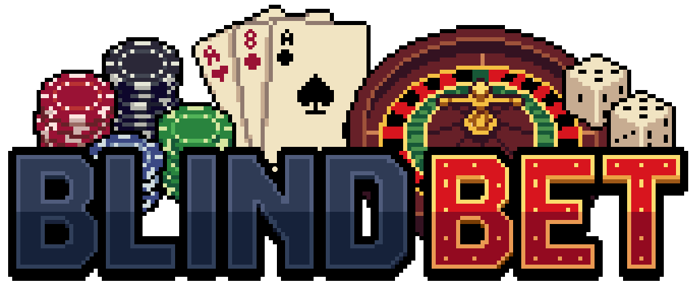

<div align="center">

  

  # Blind Bet (Python Edition)

  **Edukacyjna reimplementacja hitu roguelike "Balatro" stworzona od zera.**
  <br>
  *Brak silnika Unity/Godot. Czysty kod, matematyka i shadery.*

  <p>
    <a href="https://www.python.org/">
      
    </a>
    <a href="https://pyglet.org/">
      
    </a>
    <a href="#">
      
    </a>
    <a href="LICENSE">
      
    </a>
  </p>

  <p>
    <a href="#-o-projekcie">🃏 O Projekcie</a> •
    <a href="#-funkcjonalności">✨ Funkcjonalności</a> •
    <a href="#-instalacja-i-uruchomienie">🚀 Instalacja</a> •
    <a href="#-struktura-projektu">📂 Struktura</a> •
    <a href="#%EF%B8%8F-roadmapa">🗺️ Roadmapa</a>
  </p>
</div>

---

## 🃏 O Projekcie

Ten projekt to **klon gry Balatro** napisany całkowicie w języku **Python**, wykorzystujący bibliotekę **Pyglet** do obsługi grafiki oraz natywne shadery **OpenGL (GLSL)**.

Celem projektu jest nauka architektury gier 2D bez użycia gotowych silników ("Game Engines"), zrozumienie matematyki stojącej za animacjami, shaderami oraz optymalizacją renderowania (Batch Rendering).

### 🎮 Aktualna Wersja: `v0.4.0 (Alpha)`
Wersja ta wprowadza **pełną refaktoryzację architektury projektu** według wzorca MVC, separację odpowiedzialności (Stan gry, Logika, UI), kompletny redesign interfejsu (HUD) wzorowany na oryginale, oraz profesjonalną strukturę pakietów Python z wydzielonymi modułami.

---

## ✨ Funkcjonalności

Co już działa w tej wersji?

- [x] **Architektura Projektu (NOWE)**:
  - **MVC Pattern**: Separacja modelu (GameState), logiki (GameManager) i widoku (UI).
  - **Modułowa Struktura**: Pakiety `config/`, `core/`, `ui/`, `utils/`.
  - **Zarządzanie Stanem**: Centralna klasa `GameState` dla całego stanu gry.
  - **Manager Pattern**: `GameManager` obsługuje mechaniki rozgrywki.
- [x] **Zaawansowany Interfejs Gry (HUD)**:
  - **Sidebar**: Panel boczny ze statystykami rundy, celem punktowym i licznikiem zasobów.
  - **Score Pill**: Dynamiczna wizualizacja wyniku (Chips x Mult) w stylu Balatro (Blue/Red).
  - **Statystyki**: Licznik dostępnych Rąk i Zrzutek.
  - **Info Popup**: Tabela układów pokerowych z wartościami punktowymi i licznikiem użycia w danej grze.
- [x] **Pełna Pętla Rozgrywki**:
  - System rund z rosnącym poziomem trudności (Target Score).
  - Warunki zwycięstwa (osiągnięcie celu) i przegranej (brak rąk).
  - System ekonomii (zdobywanie $ za wygrane rundy).
  - Ekran "Game Over" z możliwością restartu.
- [x] **Logika Kart i Pokera**:
  - Poprawna hierarchia układów (Royal Flush > ... > High Card).
  - Mechanika odrzucania (Discard) i dobierania kart do limitu ręki.
  - **Sortowanie ręki**: Po randze i po kolorze.
  - Ograniczenia logiczne (max 5 kart do zagrania/odrzucenia).
- [x] **Dynamiczne Tło (Shader GLSL)**:
  - Proceduralnie generowany efekt "Liquid Plasma".
  - Dynamiczna pikselizacja sterowana suwakiem.
  - Płynna zmiana palet kolorów.
- [x] **System Ustawień**:
  - Zapis i odczyt ustawień do pliku JSON.
  - Pełna konfiguracja wideo, audio i rozgrywki.

---

## 🛠️ Technologie

Projekt został zbudowany przy użyciu:

| Technologia | Opis |
| :--- | :--- |
| **Python 3.12** | Główny język logiki gry. |
| **Pyglet 2.0+** | Biblioteka okienkowa i obsługa OpenGL. |
| **GLSL 330** | Język shaderów (efekty wizualne tła). |
| **MVC Architecture** | Separacja Model-View-Controller. |
| **OOP** | Architektura obiektowa (klasy dla Kart, UI, Stanów). |
| **JSON** | Format zapisu ustawień gracza. |

---

## 🚀 Instalacja i Uruchomienie

Aby uruchomić grę na swoim komputerze, wykonaj następujące kroki:

### 1. Wymagania
Musisz mieć zainstalowanego [Python 3.10+](https://www.python.org/downloads/).

### 2. Klonowanie repozytorium
```bash
git clone https://github.com/MaxPowerPL/Blind-Bet.git
cd Blind-Bet
```

### 3. Konfiguracja środowiska (Zalecane)

**Windows:**
```bash
python -m venv venv
.\venv\Scripts\activate
```

**macOS/Linux:**
```bash
python3 -m venv venv
source venv/bin/activate
```

### 4. Instalacja zależności
```bash
pip install pyglet
```

### 5. Uruchomienie
```bash
python main.py
```

### 6. Sterowanie
- **Mysz**: Obsługa całego interfejsu (karty, przyciski).
- **Gra**:
  - Kliknij karty, aby je zaznaczyć/odznaczyć.
  - "ZAGRAJ": Zatwierdza wybrany układ.
  - "ODRZUĆ": Wymienia wybrane karty (tracisz zrzutkę).
  - "RANGA/KOLOR": Sortuje karty w ręce.
- **ESC**: Menu pauzy / Powrót / Wyjście.

---

## 📂 Struktura Projektu
Profesjonalny podział kodu na moduły zgodnie z wzorcem MVC:

```text
📦 Blind Bet
┣ 📂 assets/
┃ ┣ 📂 images/
┃ ┃ ┣ 🖼️ cards_sheet.png  # Atlas tekstur kart (5x13 grid, Pixel Art)
┃ ┃ ┗ 🖼️ logo.png         # Logo gry (Blind Bet)
┃ ┣ 📂 sounds/            # (Przygotowane na przyszłość)
┃ ┗ 📂 fonts/             # (Przygotowane na przyszłość)
┣ 📂 config/
┃ ┣ 📜 init.py
┃ ┗ 📜 consts.py          # Stałe, kolory (Balatro style), GameSettings
┣ 📂 core/
┃ ┣ 📜 init.py
┃ ┣ 📜 card.py            # Klasa Card (reprezentacja karty)
┃ ┣ 📜 game_logic.py      # Deck i HandEvaluator (logika pokera)
┃ ┣ 📜 game_manager.py    # GameManager (mechaniki gry)
┃ ┗ 📜 game_state.py      # GameState (centralny stan gry)
┣ 📂 ui/
┃ ┣ 📜 init.py
┃ ┣ 📜 background.py      # ShaderBackground (shadery GLSL)
┃ ┣ 📜 game_ui_manager.py # GameUIManager (UI w trybie gry)
┃ ┣ 📜 menu.py            # MainMenu (menu główne)
┃ ┣ 📜 options.py         # OptionsMenu (menu opcji)
┃ ┣ 📜 overlays.py        # Popupy (HandHierarchyPopup, GameOverOverlay)
┃ ┗ 📜 ui.py              # Komponenty UI (Button, Slider, Checkbox, ScorePill)
┣ 📂 utils/
┃ ┣ 📜 init.py
┃ ┗ 📜 resources.py       # Ładowanie zasobów (sprite sheet)
┣ 📂 venv/                # Środowisko wirtualne Python (gitignore)
┣ 📜 .gitignore
┣ 📜 main.py              # Główna pętla, inicjalizacja, event handling
┣ 📜 settings.json        # Plik ustawień (generowany automatycznie)
┗ 📜 README.md
```


### Opis głównych modułów:

#### `config/`
| Plik | Opis |
|------|------|
| `consts.py` | Wszystkie stałe projektu (kolory UI, stany gry, układy pokerowe), klasa `GameSettings` z metodami `save()` i `load()`. |

#### `core/` (Model & Logic)
| Plik | Opis |
|------|------|
| `card.py` | Klasa `Card` z logiką skalowania, pozycjonowania, animacji Lerp i detekcji kliknięć. |
| `game_logic.py` | `Deck` (tasowanie, rozdawanie) oraz `HandEvaluator` (algorytm rozpoznawania układów pokerowych i punktacji). |
| `game_state.py` | Klasa `GameState` - centralne zarządzanie stanem gry (punkty, rundy, karty, statystyki). |
| `game_manager.py` | Klasa `GameManager` - mechaniki gry (dobieranie, zagrywanie, odrzucanie, warunki końca). |

#### `ui/` (View)
| Plik | Opis |
|------|------|
| `background.py` | Implementacja shaderów GLSL (vertex + fragment), proceduralna generacja efektu Plasma. |
| `menu.py` | Klasa `MainMenu` z dynamicznym ładowaniem logo i trzema przyciskami akcji. |
| `options.py` | Zaawansowana klasa `OptionsMenu` z systemem zakładek (Gra/Grafika/Dźwięk). |
| `game_ui_manager.py` | Klasa `GameUIManager` - zarządzanie całym HUD w trybie gry (sidebar, przyciski, score pill). |
| `overlays.py` | `HandHierarchyPopup` (tabela układów) i `GameOverOverlay` (ekran końca gry). |
| `ui.py` | Komponenty UI wielokrotnego użytku: `Button`, `Slider`, `Checkbox`, `ScorePill`. |

#### `utils/`
| Plik | Opis |
|------|------|
| `resources.py` | Ładowanie i cięcie atlasu tekstur (Sprite Sheet), konfiguracja filtrów tekstur (Pixel Art). |

#### Główny plik
| Plik | Opis |
|------|------|
| `main.py` | Inicjalizacja okna Pyglet, zarządzanie stanami gry (Menu/Gra/GameOver), główna pętla update/render, obsługa eventów. |

---

## 🎨 System Shaderów

Gra wykorzystuje **OpenGL Shading Language (GLSL 330)** do generowania dynamicznego tła:

### Efekty wizualne:
- **Liquid Plasma**: Proceduralna animacja fal sinusoidalnych.
- **Pikselizacja**: Uniform `u_pixels` kontrolowany suwakiem "Intensywność CRT" (zakres 20-500).
- **Palety kolorów**: 5 predefiniowanych schematów kolorystycznych z automatycznym przełączaniem.
- **Interpolacja**: Płynne przejścia między paletami przy użyciu algorytmu Lerp.

### Dostępne palety:
1. **OGIEŃ** - Czerwono-pomarańczowo-żółta.
2. **MATRIX** - Zielona matrycowa.
3. **CYBERPUNK** - Niebiesko-różowa.
4. **VOID (Pustka)** - Ciemna fioletowa.
5. **TOKSYCZNY** - Żółto-fioletowa.

---

## 🗺️ Roadmapa
Plany rozwoju projektu na najbliższe miesiące:

### Faza 1: Core Mechanics (Ukończona ✅)
- [x] Rendering kart i tła.
- [x] Podstawowe UI i Menu.
- [x] System shaderów CRT i Plasma.
- [x] Menu Opcji z systemem zakładek.
- [x] Zapis i odczyt ustawień do JSON.
- [x] Responsywne skalowanie przy resize okna.
- [x] Fix anchor point dla logo (Pixel-Perfect).

### Faza 2: Logika Pokera (Ukończona ✅)
- [x] Algorytm sprawdzania układów (Para, Trójka, Strit, Kolor, Full, Kareta, Poker).
- [x] System punktacji (Chips + Mult).
- [x] Mechanika odrzucania i dobierania kart.
- [x] Generowanie talii i losowość (shuffle).
- [x] UI wyświetlania znalezionego układu.

### Faza 3: Refaktoryzacja Architektury (Ukończona ✅ - v0.4.0-alpha)
- [x] Separacja logiki na pakiety (config, core, ui, utils).
- [x] Implementacja wzorca MVC (Model-View-Controller).
- [x] Centralizacja stanu gry (GameState).
- [x] Wydzielenie managera gry (GameManager).
- [x] Separacja UI do dedykowanych modułów.
- [x] Czysty main.py z tylko inicjalizacją i event handlingiem.

### Faza 4: Roguelike Elements (Następny krok 🚧)
- [ ] Implementacja Jokerów (modyfikatory punktów).
- [ ] Sklep (kupowanie kart i ulepszeń).
- [ ] System Blindów (Small Blind, Big Blind, Boss Blinds).
- [ ] Progresja runów (Ante 1-8).
- [ ] Unlockable content (nowe talie, jokery).

### Faza 5: Audio & Polish
- [ ] Efekty dźwiękowe (SFX) przy klikaniu, punktacji, kupowaniu.
- [ ] Muzyka w tle (adaptive soundtrack).
- [ ] System zapisu gry (Save/Load progressu).
- [ ] Animacje wejścia/wyjścia kart (tweening).
- [ ] Particle effects przy wysokich wynikach.
- [ ] Screen shake i juice effects.

### Faza 6: Balancing & Content
- [ ] Balansowanie ekonomii (ceny, nagrody).
- [ ] Dodanie więcej Jokerów (50+ unikalnych).
- [ ] Voucher system (permanent upgrades).
- [ ] Spectral Cards i Planet Cards.
- [ ] Challenge Runs (modyfikatory trudności).

---

## 🐛 Znane Problemy i Rozwiązania

### ✅ Naprawione w v0.4.0-alpha:
- **Kolejność układów**: Naprawiono błąd, gdzie Kolor (Flush) był wykrywany jako Para/Wysoka karta.
- **Centrowanie kart**: Karty są teraz poprawnie centrowane na starcie rundy.
- **UI Glitches**: Poprawiono cienie przycisków i ramki popupów.
- **Spaghetti Code**: Kompletna refaktoryzacja - kod podzielony na moduły według wzorca MVC.
- **Zarządzanie stanem**: Stan gry przeniesiony do dedykowanej klasy GameState.

### 🔧 Do poprawy:
- [ ] Brak obsługi kontrolera/gamepad.
- [ ] Brak lokalizacji (tylko polski).
- [ ] Menu opcji nie obsługuje przewijania (wszystko musi zmieścić się na ekranie).

---

## 📝 Changelog

### v0.4.0-alpha (Refaktoryzacja Architektury)
**BREAKING CHANGES:**
- Pełna refaktoryzacja struktury projektu według wzorca MVC
- Kod podzielony na pakiety: `config/`, `core/`, `ui/`, `utils/`
- Wydzielenie `GameState` do zarządzania stanem gry
- Wydzielenie `GameManager` do obsługi mechanik rozgrywki
- Wydzielenie `GameUIManager` do obsługi interfejsu gry
- Wydzielenie overlayów (`HandHierarchyPopup`, `GameOverOverlay`) do oddzielnego modułu
- Czysty `main.py` z tylko inicjalizacją i event handlingiem
- Dodanie plików `__init__.py` dla prawidłowej struktury pakietów Python

**Zmiany techniczne:**
- Separacja odpowiedzialności (Separation of Concerns)
- Łatwiejsza rozbudowa i testowanie kodu
- Lepsza czytelność i utrzymywalność projektu

---

## 📜 Licencja

Ten projekt jest udostępniony na **Własnej Licencji Zastrzeżonej (Custom Proprietary License)**.

### Co MOŻESZ robić:
- ✅ Przeglądać i studiować kod źródłowy w celach edukacyjnych
- ✅ Pobrać i uruchomić grę do użytku osobistego, niekomercyjnego
- ✅ Umieścić ten projekt w swoim portfolio lub CV
- ✅ Rekruterzy mogą przeglądać i testować kod podczas procesów rekrutacyjnych

### Czego NIE MOŻESZ robić bez zgody:
- ❌ Używać tego kodu komercyjnie lub w płatnych projektach
- ❌ Publikować lub dystrybuować zmodyfikowane wersje
- ❌ Umieszczać ten kod w innych publicznych repozytoriach
- ❌ Używać fragmentów kodu w aplikacjach komercyjnych

### Użytek komercyjny
Jeśli chcesz użyć tego oprogramowania komercyjnie lub opublikować modyfikacje, skontaktuj się ze mną: **dominik.kielczewski@gmail.com**

Zobacz pełne warunki prawne w pliku [LICENSE](LICENSE).


---

<div align="center">

### ⭐ Jeśli podoba Ci się ten projekt, zostaw gwiazdkę na GitHubie! ⭐

☕ Stworzono używając Python & Pyglet.
<br>
<sub>Ten projekt jest fanowską wersją edukacyjną i nie jest powiązany z LocalThunk ani Playstack.</sub>
<br>
<sub>**Licencja Zastrzeżona** - Kod jest widoczny tylko w celach edukacyjnych. Zobacz [LICENSE](LICENSE) po szczegóły.</sub>


<p>
  <a href="https://github.com/MaxPowerPL/Blind-Bet/issues/new?template=bug_report.yml">🐛 Zgłoś Bug</a> •
  <a href="https://github.com/MaxPowerPL/Blind-Bet/issues/new?template=feature_request.yml">💡 Zaproponuj Funkcję</a> •
  <a href="https://github.com/MaxPowerPL/Blind-Bet/wiki">📖 Wiki</a>
</p>


</div>